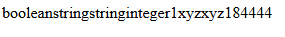

## Variables y su tipo:
  `$a` -> BOOLEAN

  `$b` -> STRING

  `$c` -> STRING

  `$d` -> INTEGER

  `$f` -> INTEGER (resultado de la función doble)

  `$g` -> INTEGER (resultado de la suma de la variable $f + 10)

## Operadores:
  `*` (multiplicación)  -> usado en ($i * 2;) y ($d * 3;) 

  `+=` (suma y asignación) -> usado en ($d += 4;) y ($f += 10;)

  `++` (incremento postfijo) -> usado en ($d++) y (++$d)

  `?` (operador ternario) -> usado en ($a ? ++$d : $d * 3;)

  `=` (asignación) -> usado en ($a = TRUE; $b = "xyz"; $c = 'xyz'; $d = 12;)

## Funciones y sus parametros:
  `function doble($i)` -> recibe un parámetro "$i" y devuelve el doble de su valor.

  `gettype(variable)`-> devuelve el tipo de la variable pasada como argumento.

## Estructuras de control:
  `if (is_int($d))` -> verifica si "$d" es un entero.

  `if (is_string($a))` -> verifica si "$a" es una string.

 ## Salida por pantalla:

  