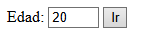
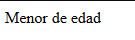
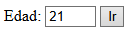
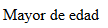

# Ejercicio 3-b

## Salida por pantalla :
El codigo muestra un input que pide una edad donde si se coloca algun numero menor o igual a 20, muestra el texto "Menor de edad"
  

  

y si de coloca algun numero mayor o igual a 21, muestra el texto "Mayor de edad"
  

  

