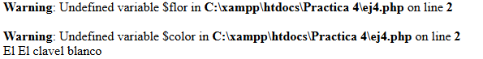

# Ejercicio 4

## Salida por pantalla:
El codigo muestra error ya que en la primera linea las variables "$flor" y "$color" no estan definidas en el archivo que incluye al archivo "datos.php", luego se incluye el archivo "datos.php" y por eso se muestra el texto con los datos de las variables.

