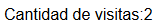

# Ejercicio 5

## Salida por pantalla:
El codigo hace que cada que se actualice la pagina o se ingrese nuevamente, aumenta el valor del archivo "contador.dat" y lo muestra por pantalla.

El archivo "contador.php" contiene la logica para poder acceder al archivo "contador.dat" y modificar su valor.

Ejemplo de primer ingreso a la pagina:

Luego de recargarla o volver a ingresar:

